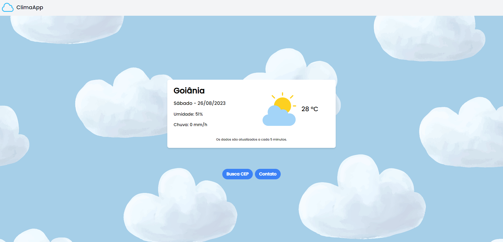

## Perguntas

1- Qual foi a maior dificuldade que você enfrentou ao realizar o teste?

R: Encontrar uma API que recebia como parâmetro a rua e retornasse o endereço, tinha uma em mente, mas não atendia as funcionalidades desejadas, mas consegui encontrar outra.


2- Descreva a funcionalidade e o por quê da utilização das bibliotecas escolhidas por você para concluir o desafio.

R: O app está totalmente funcional, proporcionando a melhor experiência para o usuário, utilizei o tailwindcss que acabou ficando mais fácil por ter conhecimento na biblioteca e foi possível trazer uma estilização visual mais bonita para o app.


3- Como você se vê daqui a 5 anos?

R: Eu me vejo em um patamar mais elevado na carreira de dev full-stack, com estabilidade financeira e podendo proporcionar melhor qualidade de vida para minha família.


4- Caso você tenha dado um “Tchammmm!” na sua aplicação, descreva o que você fez, como isso irá melhorar a experiência do usuário.

R: Adicionei a opção de dark mode na aplicação, pois muitos usuários preferem apps com essa opção trazendo uma melhor visibilidade pra quem não se familiariza com aplicações de temas claros.

---

## 💻 Sobre 

O objetivo do projeto é criar uma que mostra o clima atual da cidade do usuário e realiza uma busca do logradouro, conectada com APIs.

--- 

## 🚀 Link do projeto hospedado na Vercel (clique para entrar)

<a href="https://clima-app-rouge.vercel.app/" target="_blank" rel="external">

</a>
<h2>Link: <a href="https://clima-app-rouge.vercel.app/" target="_blank" rel="external">Acesse aqui</a></h2>


--- 

## 💻 Pré-requisitos

Antes de começar, verifique se você atendeu aos seguintes requisitos:
* Você tem uma máquina `<Windows / Linux / Mac>`
* Você instalou a versão mais recente do `NodeJS`


## ⚙️ Instalando

Para instalar execute no terminal:

npm:
```
npm i
```

yarn:
```
yarn install
```

## 🚀 Rodando o projeto

Para rodar o projeto, execute no terminal:

npm:
```
npm run dev
```
yarn:
```
yarn dev
```

## 🚀 Tecnologias utilizadas

O projeto está desenvolvido utilizando as seguintes tecnologias:

- ReactJS 
- NextJS 
- TailwindCSS
- APIRest
--- 


